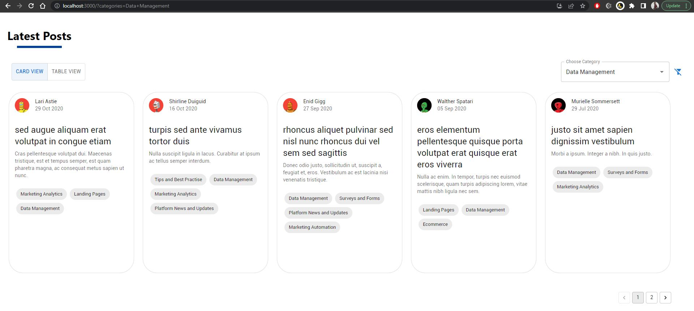
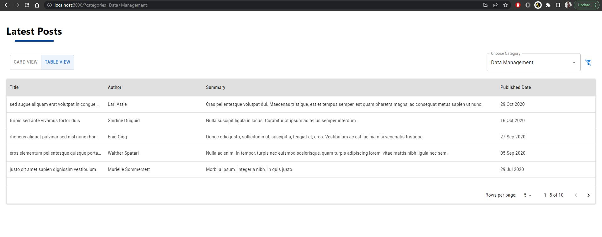
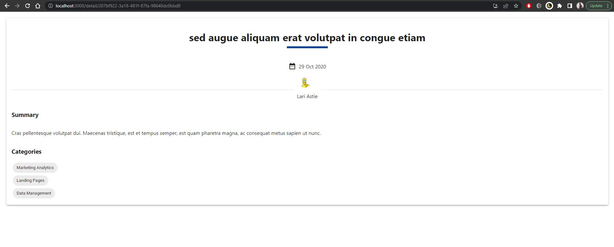

# React Assesment
Refer question here 

## Description
<p>
  Web application created using React for simple posts listing
</p>





## How to Run
Use commands below to install dependencies & run development server
- Using `npm`
```bash
npm install
npm start
```
- Using `yarn`
```bash
yarn install
yarn start
```

## Project Structure

    .
    ├── build                   # Compiled files
    ├── docs                    # Documentation files (including screenshots)
    ├── public                  # Public files
    ├── src                     # Source files
        ├── components          # Components files
            ├── core            # Common components
            ├── posts           # Post component
        ├── mock                # Mock files
        ├── shared              # Reusable code
        ├── styles              # App style
    └── README.md

## What's Done
- Implemented Card & Tabular View for Posts Listing using `Material UI`
> - with built in Pagination for Table & custom pagination for Card View
> - with loading animation
- Implemented Detail Page
- Implemented Single Select `Category` filter
> - persist filters as query params
- Converted to Typescript
- Using SCSS for CSS Preprocessor

## Enhancement to be done
- Error Handling
- Improve UI/UX

## Stay in touch

- Author - [Navin Letchumanan](https://www.linkedin.com/in/navin-letchumanan-b0988b187/)


